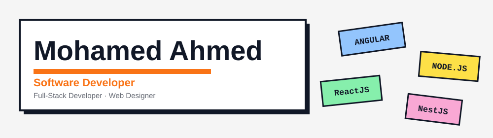

  

### About me

Computer Science student and software developer.
I like building things, learning new technologies, and solving problems with code.
 
 
Check out what I build on my portfolio.

  
  

 

### Stack

<b>Languages</b> 

 <b>Frontend</b> 

 
<b>Backend</b> 

 
<b>Databases</b> 

 
<b>Tools & Infrastructure</b> 

<h3>Leveling up right now</h3>

Designing with purpose. Engineering with intent.

